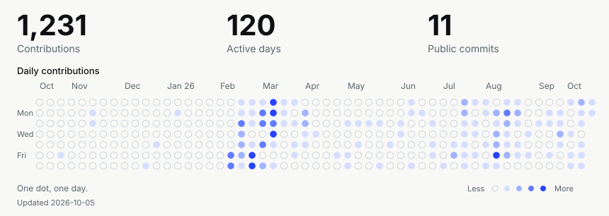

## Hi, I'm Luis

**Full-stack developer at [CodedByLoan](https://www.codedbyloan.com/).**

I build websites, applications and automations, connecting thoughtful interfaces with the systems behind them. My work spans web and mobile, backend services, integrations and legacy modernisation.

From the first sketch to deployment, I care about how things look, how they work and how they hold up over time.

[Explore my portfolio ↗︎](https://www.codedbyloan.com/) · [Get in touch ↗︎](mailto:codedbyloan@gmail.com)

## My toolkit

Technologies and tools I've worked with across projects.

<table>
<thead><tr><th align="left">Area</th><th align="left">Technologies & tools</th></tr></thead>
<tbody>
<tr>
<td valign="top" width="20%"> <strong>Languages</strong></td>
<td>JavaScript · TypeScript · Go · Java · Python · Kotlin · Dart · SQL · PL/SQL · Delphi / Object Pascal · HTML · CSS</td>
</tr>
<tr>
<td valign="top" width="20%"> <strong>Web</strong></td>
<td>React · Next.js · Angular · Vue · Astro · jQuery · PWA · Web Components</td>
</tr>
<tr>
<td valign="top" width="20%"> <strong>UI &amp; state</strong></td>
<td>Tailwind CSS · Bootstrap · Material UI · PrimeNG · Ant Design · shadcn/ui · styled-components · Radix UI · Redux · RxJS · TanStack Query · TanStack Router · React Router · React Hook Form · Zod · Motion / Framer Motion</td>
</tr>
<tr>
<td valign="top" width="20%"> <strong>Backend &amp; APIs</strong></td>
<td>Node.js · Express · Spring Boot · Spring Security · REST · GraphQL · WebSockets · Socket.IO · Webhooks · OAuth2 · Microservices</td>
</tr>
<tr>
<td valign="top" width="20%"> <strong>Data</strong></td>
<td>PostgreSQL · Supabase · Oracle · MySQL · SQLite · Firebase · Hibernate / JPA · Sequelize</td>
</tr>
<tr>
<td valign="top" width="20%"> <strong>Mobile &amp; desktop</strong></td>
<td>React Native · Expo · Flutter · Native Android · Electron</td>
</tr>
<tr>
<td valign="top" width="20%"> <strong>Cloud &amp; delivery</strong></td>
<td>Docker · Docker Compose · Kubernetes · AWS · Azure · Cloudflare · Vercel · Apache · GitHub Actions · Argo CD</td>
</tr>
<tr>
<td valign="top" width="20%"> <strong>Quality &amp; monitoring</strong></td>
<td>Playwright · Vitest · Jest · Testing Library · Selenium · Storybook · ESLint · Sonar · Sentry · Grafana</td>
</tr>
<tr>
<td valign="top" width="20%"> <strong>Automation &amp; integrations</strong></td>
<td>PowerShell · Shell scripting · Scheduled jobs · Discord.js · WhatsApp APIs · Google APIs · AI APIs · Remotion · Leaflet · MapLibre · Yjs</td>
</tr>
<tr>
<td valign="top" width="20%"> <strong>Design &amp; tools</strong></td>
<td>Figma · Blender · SQL Developer · Git</td>
</tr>
</tbody>
</table>

## Recent work

**[Meteo de les Illes ↗︎](https://www.meteodelesilles.com/)** Weather for the Balearic Islands. Forecasts, alerts and a community-powered map.

**[Doze Burger & Drink ↗︎](https://www.dozeburger.com/)** A restaurant, made digital. A mobile-first home for menus, cakes and contact.

**[Casal de Son Ferriol ↗︎](https://casaldesonferriol.vercel.app/)** A home for neighbourhood life. Activities, events and local information in two languages.

## Development activity

GitHub contributions and public commits over the last 12 months.

<!-- DEVELOPMENT-ACTIVITY:START -->

<picture>
  <source media="(max-width: 600px)" srcset="assets/activity-mobile.svg">
  
</picture>

### Latest public project commits

- **[QR-e/DOZE](https://github.com/QR-e/DOZE/commit/5b4ee66b05c9ace2e7e5fa23984dd78ebcf788d1)** · 02 Oct 2026 · [`5b4ee66`](https://github.com/QR-e/DOZE/commit/5b4ee66b05c9ace2e7e5fa23984dd78ebcf788d1)
- **[QR-e/DOZE](https://github.com/QR-e/DOZE/commit/1b395d85a69ed7b76ef8a5e8af5270f95e70270e)** · 15 Sept 2026 · [`1b395d8`](https://github.com/QR-e/DOZE/commit/1b395d85a69ed7b76ef8a5e8af5270f95e70270e)
- **[QR-e/DOZE](https://github.com/QR-e/DOZE/commit/f9798febf1ff485c0cf8ec70dedff68aa9458df9)** · 15 Sept 2026 · [`f9798fe`](https://github.com/QR-e/DOZE/commit/f9798febf1ff485c0cf8ec70dedff68aa9458df9)

View activity data

2025-10-05 to 2026-10-05. The calendar reflects contributions visible on my GitHub profile, including anonymised private activity when enabled. Commit counts and links cover public repositories. The first and last months may be partial.

| Month | Contributions |
| :--- | ---: |
| 2025-10 | 1 |
| 2025-11 | 6 |
| 2025-12 | 2 |
| 2026-01 | 4 |
| 2026-02 | 269 |
| 2026-03 | 459 |
| 2026-04 | 20 |
| 2026-05 | 19 |
| 2026-06 | 24 |
| 2026-07 | 110 |
| 2026-08 | 204 |
| 2026-09 | 89 |
| 2026-10 | 25 |

<!-- DEVELOPMENT-ACTIVITY:END -->

---

Have a project in mind? [Let's talk ↗︎](mailto:codedbyloan@gmail.com)
