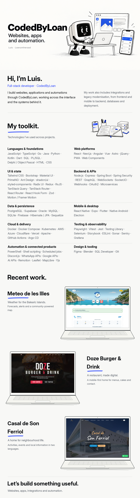

<picture>
  <source media="(max-width: 600px)" srcset="assets/profile-mobile.png">
  
</picture>

<a href="https://www.codedbyloan.com/">Portfolio ↗</a> · <a href="https://www.meteodelesilles.com/">Meteo ↗</a> · <a href="https://www.dozeburger.com/">Doze ↗</a> · <a href="https://casaldesonferriol.vercel.app/">Casal ↗</a> · <a href="mailto:codedbyloan@gmail.com">Get in touch ↗</a>

Read the text version

## About

Hi, I’m Luis. Full-stack developer at CodedByLoan.

I build websites, applications and automations through CodedByLoan, working across the interface and the systems behind it.

My work also includes integrations and legacy modernisation, from frontend and mobile to backend, databases and deployment.

## My toolkit

Technologies I’ve used across projects.

### Languages & foundations

JavaScript, TypeScript, Go, Java, Python, Kotlin, Dart, SQL, PL/SQL, Delphi / Object Pascal, HTML, CSS.

### Web platforms

React, Next.js, Angular, Vue, Astro, jQuery, PWA, Web Components.

### UI & state

Tailwind CSS, Bootstrap, Material UI, PrimeNG, Ant Design, shadcn/ui, styled-components, Radix UI, Redux, RxJS, TanStack Query, TanStack Router, React Router, React Hook Form, Zod, Motion / Framer Motion.

### Backend & APIs

Node.js, Express, Spring Boot, Spring Security, REST, GraphQL, WebSockets, Socket.IO, Webhooks, OAuth2, Microservices.

### Data & persistence

PostgreSQL, Supabase, Oracle, MySQL, SQLite, Firebase, Hibernate / JPA, Sequelize.

### Mobile & desktop

React Native, Expo, Flutter, Native Android, Electron.

### Cloud & delivery

Docker, Docker Compose, Kubernetes, AWS, Azure, Cloudflare, Vercel, Apache, GitHub Actions, Argo CD.

### Testing & observability

Playwright, Vitest, Jest, Testing Library, Selenium, Storybook, ESLint, Sonar, Sentry, Grafana.

### Automation & connected products

PowerShell, Shell scripting, Scheduled jobs, Discord.js, WhatsApp APIs, Google APIs, AI APIs, Remotion, Leaflet, MapLibre, Yjs.

### Design & tooling

Figma, Blender, SQL Developer, Git.

## Recent work

### [Meteo de les Illes](https://www.meteodelesilles.com/)

Weather for the Balearic Islands. Forecasts, alerts and a community-powered map.

### [Doze Burger & Drink](https://www.dozeburger.com/)

A restaurant, made digital. A mobile-first home for menus, cakes and contact.

### [Casal de Son Ferriol](https://casaldesonferriol.vercel.app/)

A home for neighbourhood life. Activities, events and local information in two languages.

